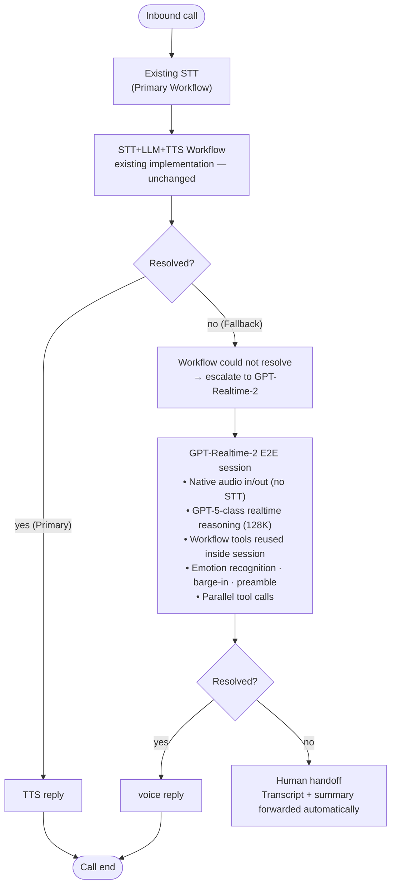

# GPT-Realtime-2 Live Demo — E-commerce Voice CS

> 🌐 **Language**: **English** · [한국어](README.md)

A reference implementation intended for demos and experiments. Not aimed at production quality.

A hybrid customer-service architecture live demo: a conventional STT+LLM+TTS workflow stays as the primary path, and complex/ambiguous requests or long/complaint-toned calls are escalated to a GPT-Realtime-2 end-to-end session.

---

## Quick Deployment

The recommended flow is to deploy and run first, then read the architecture and scenario sections below.

### `azd up` (recommended — automated)

#### Prerequisites

| Item | Windows | Linux | macOS |
|------|---------|-------|-------|
| [Azure CLI](https://docs.microsoft.com/cli/azure/install-azure-cli) | yes | yes | yes |
| [Azure Developer CLI (azd)](https://learn.microsoft.com/azure/developer/azure-developer-cli/install-azd) | yes | yes | yes |
| Python 3.11+ | yes | yes | yes |
| PowerShell (pwsh) | built-in | — | — |
| bash | — | built-in | built-in |

> **Windows**: the PowerShell hook (`scripts/load_python_env.ps1`) runs automatically. `azd` invokes it via `pwsh -NoProfile -ExecutionPolicy Bypass`, so no PowerShell execution-policy change is required.
> **Linux/macOS**: the bash hook (`scripts/load_python_env.sh`) runs automatically.
> Both hooks are registered; only the one that applies to your OS will succeed.

On Windows you may see this warning, which is expected and safe to ignore:

```
WARNING: 'preprovision' hook failed ...: 'bash' is not recognized as an internal or external command
```

To support Windows/Linux/macOS at the same time, both sh (bash) and pwsh (PowerShell) hooks are registered. On Windows the bash hook fails and the PowerShell hook succeeds; on Linux/macOS the opposite.

> **Troubleshooting reference** — usually unnecessary; only refer to this on the rare occasion that a hook fails.
>
> If a PowerShell hook turns red during `azd up`, `backend/.env` may not be generated. In that case the backend will fall back to system-wide environment variables (`AZURE_OPENAI_ENDPOINT`, `AZURE_OPENAI_DEPLOYMENT`) and could silently connect to the wrong resource, returning 404.
>
> Recovery depends on whether the Bicep deployment itself succeeded.
>
> - **Bicep succeeded, only the postprovision hook failed** — `azd` has already cached the Bicep outputs in `.azure/<env-name>/.env`, so a single line restores everything:
>   ```powershell
>   pwsh -NoProfile -ExecutionPolicy Bypass -File .\scripts\write_env.ps1
>   ```
>   (You are in this case if `azd env get-value AZURE_OPENAI_ENDPOINT` returns a value.)
> - **Bicep also failed** — `.azure/<env-name>/.env` is empty and the script above would write a blank file. Re-run `azd provision`, or check the portal and author `backend/.env` by hand:
>   ```ini
>   AZURE_OPENAI_ENDPOINT=https://<your-aiservices>.cognitiveservices.azure.com/
>   AZURE_OPENAI_DEPLOYMENT=gpt-realtime-2
>   ```
>
> At startup the backend prefers `backend/.env` over OS environment variables (`load_dotenv(override=True)`).
>
> **Self-diagnostics**
>
> - The backend **fails fast (SystemExit)** on startup if `AZURE_OPENAI_DEPLOYMENT` does not contain `realtime` or if the endpoint does not look like an Azure OpenAI URL. This prevents silent binding to the wrong resource.
> - At runtime, `http://localhost:8000/health` returns the masked endpoint, the deployment in use, the `.env` path, and the active locale. Opening it once in a browser is a one-second diagnosis.
> - `write_env.ps1` / `write_env.sh` refuse to write an empty `backend/.env` and stop with an error if `azd env` is missing values.

#### Running it

`gpt-realtime-2` is a Preview model with very limited default quota. The quota-increase form does not yet list this model, so stay within the default quota.

If you hit `Insufficient quota` on redeploy, wipe the existing resources first and redeploy from scratch:

```powershell
azd down --purge   # full delete, including AI Services soft-delete
azd up             # fresh deploy
```

`--purge` also removes the AI Services soft-deleted shells, avoiding name conflicts when redeploying with the same name.

##### Windows (PowerShell)

```powershell
azd auth login
azd env new rt2demo
azd env set AZURE_LOCATION eastus2
azd env set DEMO_LOCALE en          # default locale = English
azd up
```

##### Linux / macOS

```bash
azd auth login
azd env new rt2demo
azd env set AZURE_LOCATION eastus2
azd env set DEMO_LOCALE en          # default locale = English
azd up
```

What `azd up` does:
1. **preprovision hook** — creates the Python venv and runs `pip install -r backend/requirements.txt`
2. **Bicep deployment** — resource group, Azure AI Services (`@2026-03-01`), Foundry Project, `gpt-realtime-2` model deployment (GlobalStandard, capacity 10)
3. **postprovision hook** — auto-generates `backend/.env` (endpoint / deployment / locale)

### Running locally

#### Windows

Recommended (not affected by execution policy):

```powershell
pwsh -ExecutionPolicy Bypass -File scripts\run_backend.ps1
```

Or with the venv activated:

```powershell
cd backend
.venv\Scripts\activate
uvicorn main:app --reload --port 8000
```

> If `.venv\Scripts\activate` fails with `... cannot be loaded because running scripts is disabled on this system ...`, PowerShell's execution policy is blocking the script. Use any one of:
>
> - the `scripts\run_backend.ps1` helper above (no policy impact)
> - loosen the policy for the current user: `Set-ExecutionPolicy -Scope CurrentUser -ExecutionPolicy RemoteSigned`
> - use cmd: `backend\.venv\Scripts\activate.bat`

#### Linux / macOS

```bash
cd backend
source .venv/bin/activate
uvicorn main:app --reload --port 8000
```

Browser: `http://localhost:8000?lang=en`

---

## Locale (i18n)

This project supports both English and Korean. The README you are reading is the **English-default** entry point; the Korean entry point is [README.md](README.md).

Behavior is identical across locales — only UI labels, agent prompts and tool responses change.

### How locale is resolved

| Layer | Mechanism | Default |
|------|----------|---------|
| Server | `DEMO_LOCALE` environment variable (`ko` \| `en`) | `ko` |
| Client | `?lang=ko` / `?lang=en` query string, then a `KO/EN` toggle in the header (saved to `localStorage`) | follows server |
| Synchronization | The client sends its `locale` in the first WebSocket message (`demo_inject`). The server prefers the client's value for that session. | client wins |

This means the two layers can never disagree within a session — the client is authoritative. The `DEMO_LOCALE` env var only sets the **server default** for pre-session prompts and for direct `/health` / log output.

### Make English the default end-to-end

If you followed this README, you already have it:

```powershell
azd env set DEMO_LOCALE en
```

Then open the UI as:

```
http://localhost:8000?lang=en
```

Or use the `KO / EN` toggle in the page header to switch on the fly.

### Switch to Korean

Either follow [README.md](README.md), or simply:

```powershell
azd env set DEMO_LOCALE ko
```

and visit `http://localhost:8000?lang=ko` (or omit `?lang` — `ko` is the global default).

### Adding a new language (e.g. Japanese `ja`)

A locale lives in two places: a backend string table and a frontend JSON table. Both use the same key shape, so the fastest path is to copy `ko` / `en` side by side and translate values only.

1. **Add a backend string table** — copy `backend/locales/ko.py` to `backend/locales/ja.py` and translate the values only. Keep the keys identical (`agents.root.system_message`, `tools.lookup_order.description`, `greetings.default`, …); code references them as `t("...")`.
2. **Register it on the backend** — add `"ja": ja_table` to the `LOCALES` dict in `backend/locales/__init__.py` (with `from . import ja`).
3. **Add a frontend string table** — copy `frontend/i18n/ko.json` to `frontend/i18n/ja.json` and translate values only. Include the workflow mock lines (`workflow.S1.msg.*` …) and preset history (`preset.S3.history`) under the same keys.
4. **Register it on the frontend** — add `'ja'` to the `AVAILABLE = ['ko', 'en']` array near the top of `frontend/i18n.js`.
5. **(Optional) Add a header toggle button** — drop `<button class="locale-btn" data-locale="ja">JA</button>` into the `.locale-toggle` block in `frontend/index.html`. Without the button, `?lang=ja` in the URL still works.
6. **(Optional) Make it the server default** — `azd env set DEMO_LOCALE ja`, or `DEMO_LOCALE=ja` in `backend/.env`.

Verify by restarting the backend, checking that `available_locales` at `http://localhost:8000/health` includes `"ja"`, then opening `?lang=ja` and confirming the labels, initial greeting, and tool responses all render in Japanese. Missing keys fall back to `ko` on the frontend and to the raw key string on the backend, so if you see an English key on screen, that's the one to fill in.

---

## Model spec

| Item | Value |
|------|---|
| Model | `gpt-realtime-2` |
| Version | `2026-05-06` |
| Status | Preview |
| Context | Input 32K / Output 4K tokens |
| Audio | PCM16 24 kHz streaming |
| WebSocket endpoint | `/openai/v1/realtime?model={deployment}` |
| Key new capabilities | Reasoning, staged response (preamble + final), improved instruction-following |
| Supported region | GlobalStandard — `eastus2` recommended for the AI Services resource (`swedencentral`, `southindia` also possible) |

> `gpt-realtime-2` understands audio natively, so the fallback path does not need a separate STT chain. It is a real-time conversational model that goes beyond simple voice responses by including internal reasoning, letting it handle complex or multi-step requests directly inside the voice interface while preserving context across long calls.

Preview status. In multilingual settings (including Korean) the prosody and naturalness of speech may vary by environment.

### How the current web UI handles transcription

- No separate `gpt-realtime-whisper` deployment is used.
- The browser captures microphone audio as PCM16 24 kHz and streams it over `/ws`.
- Inside the same `gpt-realtime-2` session, the backend sets `session.audio.input.transcription.model = "whisper-1"` to receive user-utterance text.
- User captions are rendered from `input_audio_transcription.completed` events in the center chat.
- Agent captions stream in from `response.output_audio_transcript.delta` events.
- In other words, the transcript visible in the UI is not from a separate transcription deployment; it is the transcript events generated by the same realtime session.

---

## Demo scenarios

| Preset | Scenario | Point |
|--------|---------|-------|
| S1 Simple FAQ | "How long does delivery take?" | Primary path handles it quickly (workflow completes) |
| S2 Complex intent | Change order + change address + apply coupon, all at once | RT-2 multi-tool, complex-intent handling |
| S3 Upset customer | "Why is my delivery so late!" | RT-2 emotion recognition + empathetic response |
| S4 Ambiguous request | "Uh, wait... actually I want a refund..." | RT-2 utterance correction / context inference |

## Using the web UI

### Default flow

1. On the left panel pick a scenario preset, or use the manual toggles to set customer state.
2. Click `Start session`. The browser opens `/ws` and immediately sends the current `demoState` to the backend.
3. The backend uses that state to build the session prompt, opens the realtime session, and microphone capture starts once the session is connected.
4. The initial response is a tailored greeting based on the injected context if a preset is selected; with the default state it starts with a plain greeting (`Hello, how can I help you?`).
5. The center panel streams user/agent transcripts; the top status chip cycles through `listening`, `thinking`, `speaking`.
6. The right panel shows the active agent and tool-call results.
7. Click `End session` to stop mic capture, send `session_end`, and close the session.

### Buttons & inputs

| UI element | Current behavior |
|---|---|
| `Start session` | Immediately after the WebSocket opens, the current demo state is pushed to the server. The server uses it to build the session prompt and first greeting, then mic capture begins. |
| `End session` | Cleans up mic / audio context, sends a session-end message, then closes the WebSocket. |
| `S1`..`S4` presets | Rewrite the left workflow simulation, flip the relevant toggles together, and inject the same preset payload to the server. |
| `Customer tier` | Sets `customer_tier`. Values are `regular` / `VIP`; used by customer-policy branching (benefits, priority). |
| `Request tone` | Sets `request_tone`. Values are `normal` / `urgent` / `complaint`; affects response tone (empathy / urgency-first) and transfer-context. |
| `Order status` | Sets `order_status`. Affects delivery/refund tool responses and transfer-context. |
| `Inquiry type` | Sets `inquiry_type`. Decides which transfer-context to inject for simple / complex / ambiguous requests. |
| `Customer ID` | Sets `customer_id`. Used as the customer identifier in transfer-context and some mock responses. |
| `Recent order ID` | Sets `recent_order_id`. Used as the default order context across order/delivery/refund/A&S responses. |
| `Recent order time` | Sets `recent_order_at`. The input uses `datetime-local`; converted to `YYYY-MM-DD HH:mm KST` before sending to the server. |
| `Repeat issue count` | Sets `repeat_count`. Structured count of repeated issues (e.g. repeated out-of-stock cancellation), used in the refund/compensation branch. |
| `Seller fault` | Toggles `seller_fault`. Whether seller-side fault (e.g. mis-listed stock) applies; informs the VIP extra-compensation branch. |
| `Order status history` | Comma-separated `order_status_history`. Used as a signal for repeated/long-standing issues. |
| `Delivery-delay compensation rule` | Demo policy: since real promised-by dates are not available, anything 3+ days past `recent_order_at` is treated as eligible and announced immediately. |
| `Voice` + `Apply` | Before the session starts you can pick from the full voice preset list (`sage`, `shimmer`, `verse`, `ballad`, `alloy`, `ash`, `echo`, `cedar`, `marin`). The UI shows only the official voice names. `Speed` below (0.75–1.25, 0.05 step) is also editable; `Apply` commits both. Disabled during an active session for consistency. |
| `Has coupon` | Toggles the `has_coupon` boolean. Reflected in complex-intent and refund/order tool results. |
| `Workflow pre-fail` | Injects `workflow_resolved=false` so a fallback transfer context is built. In this state, the first utterance starts with `It seems the previous consultation didn't meet your expectations...` instead of the normal path. |

### Reading what's on the screen

- Center chat: the actual realtime-session transcript. User and agent captions are interleaved in time order.
- Left `Workflow simulation`: a mock panel for scenario explanation, not real voice-session log.
- Right `Current Agent`: which agent is responding now. It may flip from Root to Order/Delivery/Refund/etc.
- Right tool cards: function arguments and results. Useful for tracing which tools fired in a complex request.
- First greeting: the very first utterance depends on the selected preset and the pre-injected state the server received.

### About the lookup logic

- Order/Delivery/Refund/Membership/A&S lookups in this demo are not real DB queries — they are scenario-shaped mock responses driven by `demo_state`.
- So even if the user voices an arbitrary customer or order id, the current implementation echoes it into the response while generating the answer based on demo state like `order_status`, `customer_tier`, `has_coupon`.
- Product inquiries are the exception: they answer against a fixed product-code list (`EARPHONE`, `CHARGER`, `CABLE`), so any other code is treated as a lookup failure.
- This is intentional for demo flow naturalness; production-grade validation is not yet wired in.

## Scenario walk-throughs

### Default (no preset)

- With no preset the default consultation flow starts.
- Initial response uses a generic greeting (`Hello, how can I help you?`).
- Root routes to the right specialist agent based on the user's intent.

### S1 Simple FAQ

- Preset: `S1 Simple FAQ`
- Expected flow: a typical FAQ-toned greeting, then Root closes with a short answer.
- Example utterance: `How long does delivery take?`
- What to watch: almost no agent switches or tool calls — a fast info reply.

### S2 Complex intent

- Preset: `S2 Complex intent`
- Expected flow: opens with a greeting that already acknowledges order change / address change / coupon. Multiple agents/tools are then chained.
- Example utterance: `I'd like to change my order, update the shipping address, and apply a coupon — all at once.`
- What to watch: Order, Delivery, Refund tool calls or agent switches firing in sequence.

### S3 Upset customer

- Preset: `S3 Upset customer`
- Expected flow: starts with delivery-delay + complaint context injected; the first utterance leads with apology / empathy.
- Example utterance: `Why hasn't it arrived yet? This is really frustrating.`
- What to watch: empathy first, then delivery lookup and compensation-style guidance.

### S4 Ambiguous request

- Preset: `S4 Ambiguous request`
- Expected flow: the conversation is clarification-centric; the first utterance is a re-check question.
- Example utterance: `A refund... no, exchange... wait a sec.`
- What to watch: RT-2 narrows intent down with yes/no or step-by-step confirmations.

### Manual combinations

- Skip the presets and combine `Order status`, `Inquiry type`, `Has coupon`, `Workflow pre-fail` to craft edge cases.
- Example: `order_status=refund_requested`, `inquiry_type=complex`, `has_coupon=ON`, `workflow_pre_fail=ON`.
- Best for on-the-fly Q&A during a demo or explaining what each control does.

---

## Hybrid architecture — call flow

The existing STT+LLM+TTS workflow is kept intact; only the requests it cannot resolve are escalated to a GPT-Realtime-2 end-to-end session.

### End-to-end flow



### Approach comparison

| Item | Approach A (today) | Approach C (RT-2 full E2E) | **Hybrid (recommended)** |
|------|--------------|---------------------|------------|
| Architecture | STT → Workflow → TTS | RT-2 E2E (entire call) | A primary + C fallback |
| Quality | Standard voice reply | High interactivity | **Targeted quality boost on key segments** |
| Cost | Lower per request | Higher per request | **Balanced** |
| Existing code | Kept | Replaced wholesale | **Minimal change** |

> Quality can exceed the conventional STT + LLM + TTS pipeline, but per-request cost rises, so the hybrid pattern is recommended.

---

## Architecture

```
Browser
├── WebSocket /ws  ←→  FastAPI Backend
│     ├── PCM16 24 kHz audio stream
│     ├── transcript / agent_switch / tool_call events
│     └── demo_inject (scenario control, includes `locale`)
└── Web Audio API (mic capture + PCM16 playback)

FastAPI Backend
├── RealtimeClient  →  Azure AI Services (gpt-realtime-2)
│     └── wss://{endpoint}/openai/v1/realtime?model=gpt-realtime-2
├── AssistantService (Root → Order / Delivery / Refund / ...)
├── DemoState  →  Tool mock-response injection
└── i18n (backend/locales/{ko,en}.py)  →  prompts / responses by locale

Mock-lookup implementations (where the strings live):
  backend/demo_state.py   — per-preset state values, common datastore
  backend/agents/order.py        — lookup_order, cancel_order
  backend/agents/delivery.py     — lookup_delivery, update_address
  backend/agents/refund.py       — process_refund, apply_coupon
  backend/agents/activation.py   — check_points, register_membership
  backend/agents/technical.py    — report_defect, check_warranty
  backend/agents/sales.py        — lookup_product, check_stock (fixed product-code list)

Swapping in real systems (operational view):
  The project uses a "modular tool execution binding": you can keep LLM routing intact and only replace tool execution with your own systems.

  1) Tool execution entry points (replace first)
    - Each agent's tool definition has a `returns` field — that is the real execution function.
    - e.g. `backend/agents/order.py` `lookup_order`, `backend/agents/delivery.py` `lookup_delivery`, `backend/agents/refund.py` `process_refund`.
    - Today these wrap `demo_state.get()`; replace them with calls to OMS/CRM/CS APIs.

  2) Reusable tool routing / execution layer
    - `backend/assistant_service.py`
     - `get_tools_for_session`: composes the tool list exposed to the session
     - `find_tool`: maps the tool name chosen by the model to the real executor
    - `backend/realtime_client.py`
     - Receives tool-call events from the model, runs `find_tool` result, returns the result to the model

  3) Connecting to other live agents / services
    - From inside `returns`, choose any of: in-house REST/gRPC, an existing agent gateway, or a message-queue + callback pattern.
    - Keep the parameter schemas as they are; only swap the internal executor.

  4) Recommended split for production
    - `backend/integrations/`: external system API clients
    - `backend/services/`: domain logic (compensation / priority rules)
    - `backend/repositories/`: data access abstraction
    - Agents become thin: "parse input + format tool result"

  5) Staged rollout (low-risk)
    - Step A: feature-flag `demo_state` and the real API in parallel
    - Step B: replace read-only tools first (lookup_order, lookup_delivery)
    - Step C: replace mutation tools (process_refund, cancel_order, update_address)
    - Step D: failure / timeout / retry / audit log / PII masking policies

  6) Minimum checklist before going to production
    1. Validate `customer_id`, `order_id`, `product_id` and define a standard error shape
    2. Separate user-facing fallback messages from operator-facing logs on external API failures
    3. PII (phone / address) masking and retention policy
    4. Idempotency keys (preventing duplicate refund/cancel)
    5. Disable `demo_state.py` in production mode

gpt-realtime-2 session config (new schema):
  session.type = "realtime"
  session.audio.input.transcription.model = "whisper-1"
  session.audio.input.turn_detection = server_vad
  session.audio.output.voice = "sage"  # default, changeable from the UI
  session.output_modalities = ["audio"]

Agent layout:
  Root (router)
    ├── OrderAssistant      — lookup_order, cancel_order
    ├── DeliveryAssistant   — lookup_delivery, update_address
    ├── RefundAssistant     — process_refund, apply_coupon
    ├── ProductAssistant    — lookup_product, check_stock
    ├── MembershipAssistant — check_points, register_membership
    └── AfterServiceAssistant — report_defect, check_warranty

Azure infrastructure (Bicep):
  Microsoft.CognitiveServices/accounts@2026-03-01 (AIServices)
    ├── deployments/gpt-realtime-2 (GlobalStandard, 2026-05-06, eastus2)
    └── projects/proj-* (CognitiveServices/accounts/projects — new Foundry layout)
```

---

## Project layout

```
gpt-realtime-2-livedemo/
├── backend/
│   ├── .env.example              # template for backend/.env (where it's actually loaded)
│   ├── main.py                   # FastAPI + WebSocket endpoint
│   ├── realtime_client.py        # gpt-realtime-2 client (GA endpoint)
│   ├── assistant_service.py      # multi-agent orchestrator
│   ├── demo_state.py             # demo state injection (e-commerce)
│   ├── i18n.py                   # locale resolver + t() helper
│   ├── locales/
│   │   ├── ko.py                 # Korean strings
│   │   └── en.py                 # English strings
│   ├── agents/
│   │   ├── root.py
│   │   ├── order.py
│   │   ├── delivery.py
│   │   ├── refund.py
│   │   ├── sales.py              # product inquiry
│   │   ├── activation.py         # membership / points
│   │   └── technical.py          # A&S / defects
│   └── requirements.txt
├── frontend/
│   ├── index.html
│   ├── app.js
│   ├── style.css
│   ├── i18n.js                   # locale resolution (?lang / localStorage) + data-i18n DOM walk
│   └── i18n/
│       ├── ko.json               # Korean UI strings
│       └── en.json               # English UI strings
├── infra/
│   ├── main.bicep
│   ├── main.parameters.json
│   └── modules/
│       ├── dependent_resources.bicep  # AI Services + gpt-realtime-2 deployment
│       └── foundry_project.bicep      # Foundry Project (CognitiveServices/accounts/projects)
├── scripts/
│   ├── load_python_env.sh / .ps1
│   └── write_env.sh / .ps1
├── azure.yaml
├── README.md                     # Korean README (default entry)
└── README.en.md                  # English README
```
