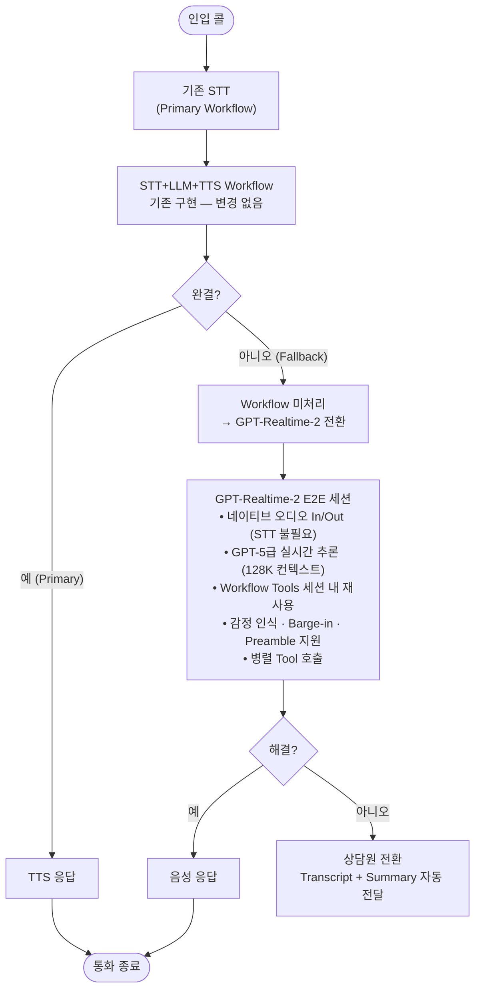

# GPT-Realtime-2 Live Demo — E-commerce Voice CS

> 🌐 **언어**: **한국어** · [English](README.en.md)

데모/실험 목적의 레퍼런스 구현입니다. 프로덕션 수준의 구현을 목표로 하지는 않습니다.

하이브리드 고객서비스 아키텍처 라이브데모: 기존 STT+LLM+TTS Workflow를 Primary로 두고, Workflow가 처리하기 어려운 복합/모호 요청이나 긴곡/불만 톤 요청을 GPT-Realtime-2 E2E 세션으로 이관하는 구조입니다.

---

## 빠른 배포 가이드

아래 순서로 먼저 배포/실행한 뒤, 이후 섹션에서 아키텍처와 시나리오를 확인하는 흐름을 권장합니다.

### `azd up`

#### 사전 요구사항

| 항목 | Windows | Linux | macOS |
|------|---------|-------|-------|
| [Azure CLI](https://docs.microsoft.com/cli/azure/install-azure-cli) | 지원 | 지원 | 지원 |
| [Azure Developer CLI (azd)](https://learn.microsoft.com/azure/developer/azure-developer-cli/install-azd) | 지원 | 지원 | 지원 |
| Python 3.11+ | 지원 | 지원 | 지원 |
| PowerShell (pwsh) | 기본 내장 | — | — |
| bash | — | 기본 내장 | 기본 내장 |

> **Windows**: PowerShell hook(`scripts/load_python_env.ps1`)이 자동 실행됩니다. `azd` 가 `pwsh -NoProfile -ExecutionPolicy Bypass` 로 호출하므로 PowerShell 실행 정책 설정 없이 동작합니다.  
> **Linux/macOS**: bash hook(`scripts/load_python_env.sh`)이 자동 실행됩니다.  
> 두 hook 모두 등록되어 있으며 해당 OS에서 동작하는 쪽만 실행됩니다.

Windows에서 아래 경고가 출력되는 것은 정상이며 무시하면 됩니다.

```
WARNING: 'preprovision' hook failed ...: 'bash' is not recognized as an internal or external command
```

Windows/Linux/macOS 동시 지원을 위해 sh(bash)와 pwsh(PowerShell) hook을 함께 등록했습니다. Windows에서는 bash hook이 실패하고 PowerShell hook이 성공하며, Linux/macOS에서는 반대로 동작합니다.

> **트러블슈팅 참고사항** — 대부분의 경우 문제 없이 진행되며, hook이 실패한 드문 경우에만 참고하면 됩니다.
>
> `azd up` 도중 PowerShell hook이 빨간색으로 실패하면 `backend/.env` 가 만들어지지 않을 수 있습니다. 이때 백엔드가 시스템 전역 환경변수(`AZURE_OPENAI_ENDPOINT`, `AZURE_OPENAI_DEPLOYMENT`)를 그대로 사용해 다른 리소스로 접속하며 404가 발생할 수 있습니다.
>
> 복구는 Bicep 배포가 성공했는지에 따라 다릅니다.
>
> - **Bicep 배포는 성공, postprovision hook만 실패한 경우** — `azd` 가 Bicep outputs 를 이미 `.azure/<env-name>/.env` 에 저장해 두었으므로 아래 한 줄로 복구됩니다.
>   ```powershell
>   pwsh -NoProfile -ExecutionPolicy Bypass -File .\scripts\write_env.ps1
>   ```
>   (`azd env get-value AZURE_OPENAI_ENDPOINT` 가 값을 반환하면 이 경우)
> - **Bicep 배포도 실패한 경우** — `.azure/<env-name>/.env` 가 비어 있어 위 스크립트가 빈 값을 씁니다. `azd provision` 을 다시 실행하거나, 포털에서 endpoint/deployment 를 확인해 `backend/.env` 를 직접 작성하세요.
>   ```ini
>   AZURE_OPENAI_ENDPOINT=https://<your-aiservices>.cognitiveservices.azure.com/
>   AZURE_OPENAI_DEPLOYMENT=gpt-realtime-2
>   ```
>
> 백엔드는 시작 시 `backend/.env` 값을 OS 환경변수보다 우선 적용합니다(`load_dotenv(override=True)`).
>
> **자가진단 도구**
>
> - 시작 시 `AZURE_OPENAI_DEPLOYMENT` 가 `realtime` 을 포함하지 않거나, endpoint 형식이 Azure OpenAI 가 아니면 백엔드가 **즉시 종료(fail-fast)** 됩니다. 잘못된 리소스로 조용히 붙는 사고를 차단합니다.
> - 실행 중에는 `http://localhost:8000/health` 로 마스킹된 endpoint / 사용 중인 deployment / `.env` 경로를 확인할 수 있습니다. 브라우저로 한 번만 열어보면 환경 진단 끝.
> - `write_env.ps1` / `write_env.sh` 는 `azd env` 에 값이 비어 있으면 빈 `.env` 를 쓰지 않고 에러로 중단합니다.

#### 실행

`gpt-realtime-2`는 Preview 모델이며 기본 할당량이 매우 제한적입니다. 할당량 증설 폼에는 아직 해당 모델이 등록되어 있지 않으므로, 기본 할당량 내에서 사용하세요.

재배포 시 `Insufficient quota` 오류가 발생하면 기존 리소스를 완전 삭제한 후 다시 배포하면 됩니다.

```powershell
azd down --purge   # 기존 리소스 완전 삭제 (soft-delete 포함)
azd up             # 깨끗한 상태에서 재배포
```

`--purge` 옵션은 AI Services의 soft-delete까지 제거하여 같은 이름으로 재배포 시 충돌을 방지합니다.

##### Windows (PowerShell)

```powershell
azd auth login
azd env new rt2demo
azd env set AZURE_LOCATION eastus2
azd up
```

##### Linux / macOS

```bash
azd auth login
azd env new rt2demo
azd env set AZURE_LOCATION eastus2
azd up
```

`azd up` 수행 내용:
1. **preprovision hook** — Python venv 생성 + `pip install -r backend/requirements.txt`
2. **Bicep 배포** — 리소스 그룹, Azure AI Services (`@2026-03-01`), Foundry Project, `gpt-realtime-2` 모델 배포 (GlobalStandard, capacity 10)
3. **postprovision hook** — `backend/.env` 자동 생성 (endpoint / deployment)

### 로컬 실행

#### Windows

권장(실행 정책에 영향받지 않음):

```powershell
pwsh -ExecutionPolicy Bypass -File scripts\run_backend.ps1
```

또는 venv를 활성화해서 실행:

```powershell
cd backend
.venv\Scripts\activate
uvicorn main:app --reload --port 8000
```

> `.venv\Scripts\activate` 실행 시 `... 이 시스템에서 스크립트를 실행할 수 없으므로 ...` 오류가 나면 PowerShell 실행 정책이 막혀 있는 것입니다. 다음 중 하나로 해결합니다.
>
> - 위의 `scripts\run_backend.ps1` 사용 (정책 영향 없음)
> - 현재 사용자에게만 정책 완화: `Set-ExecutionPolicy -Scope CurrentUser -ExecutionPolicy RemoteSigned`
> - cmd 사용: `backend\.venv\Scripts\activate.bat`

#### Linux / macOS

```bash
cd backend
source .venv/bin/activate
uvicorn main:app --reload --port 8000
```

브라우저: `http://localhost:8000`

---

## Locale (다국어)

이 프로젝트는 한국어와 영어를 모두 지원합니다. 지금 보고 있는 문서는 **한국어 기본** 진입점이며, 영어 진입점은 [README.en.md](README.en.md) 입니다.

동작 자체는 두 로캘이 동일하며, UI 라벨·에이전트 프롬프트·툴 응답 문자열만 바뀝니다.

### 로캘 결정 규칙

| 레이어 | 결정 방식 | 기본값 |
|------|----------|--------|
| 서버 | `DEMO_LOCALE` 환경변수 (`ko` \| `en`) | `ko` |
| 클라이언트 | `?lang=ko` / `?lang=en` 쿼리스트링 → 헤더의 `KO/EN` 토글(`localStorage` 저장) | 서버 기본을 따름 |
| 동기화 | 클라이언트가 첫 WebSocket 메시지(`demo_inject`)에 자신의 `locale` 을 함께 보내고, 서버는 그 세션 동안 클라이언트 값을 우선합니다. | 클라이언트 우선 |

즉, 한 세션 안에서 서버와 클라이언트 로캘이 어긋날 수 없습니다 — 클라이언트가 권위입니다. `DEMO_LOCALE` 은 **서버 기본값**(세션 전 프롬프트, `/health`, 로그 출력 등)을 정하는 역할만 합니다.

### 영어로 전환

```powershell
azd env set DEMO_LOCALE en
```

이후 브라우저에서 `http://localhost:8000?lang=en` 으로 접속하거나, 페이지 헤더의 `KO / EN` 토글로 즉시 전환할 수 있습니다. 영어 기본 가이드는 [README.en.md](README.en.md) 를 참고하세요.

### 한국어 유지

이 README 안내대로 진행하면 됩니다. 별도 환경변수 설정이 없으면 한국어가 기본입니다(`DEMO_LOCALE` 미지정 = `ko`, `?lang` 미지정 = `ko`).

### 새 언어 추가하기 (예: 일본어 `ja`)

로캘은 백엔드 문자열 테이블과 프론트엔드 JSON 테이블 두 곳에 같은 키로 추가합니다. 기존 `ko` / `en` 을 참고용으로 옆에 두고 복사하면 가장 빠릅니다.

1. **백엔드 문자열 테이블 추가** — `backend/locales/ko.py` 를 통째로 복사해 `backend/locales/ja.py` 를 만들고 각 값만 번역합니다. 키 구조는 절대 바꾸지 마세요 (`agents.root.system_message`, `tools.lookup_order.description`, `greetings.default` 등 — 코드에서 `t("...")` 로 그대로 참조합니다).
2. **백엔드 레지스트리 등록** — `backend/locales/__init__.py` 의 `LOCALES` dict 에 `"ja": ja_table` 항목을 추가합니다 (`from . import ja` import 포함).
3. **프론트엔드 문자열 테이블 추가** — `frontend/i18n/ko.json` 을 복사해 `frontend/i18n/ja.json` 을 만들고 값만 번역합니다. workflow mock 대사(`workflow.S1.msg.*` …)와 preset history(`preset.S3.history`)도 동일한 키로 포함되어야 합니다.
4. **프론트엔드 사용 가능 목록 등록** — `frontend/i18n.js` 상단의 `AVAILABLE = ['ko', 'en']` 배열에 `'ja'` 를 추가합니다.
5. **헤더 토글 버튼 추가 (선택)** — `frontend/index.html` 의 `.locale-toggle` 블록에 `<button class="locale-btn" data-locale="ja">JA</button>` 를 추가하면 클릭 한 번으로 전환됩니다. 토글을 안 추가해도 `?lang=ja` URL 로는 동작합니다.
6. **서버 기본을 새 로캘로 (선택)** — `azd env set DEMO_LOCALE ja` 또는 `backend/.env` 에 `DEMO_LOCALE=ja`.

검증: 백엔드 재기동 → `http://localhost:8000/health` 의 `available_locales` 에 `"ja"` 가 보이는지 확인 → 브라우저에서 `?lang=ja` 진입 → UI 라벨/첫 greeting/tool 응답이 모두 일본어로 나오면 OK. 키 누락 시 프론트는 KO 로, 백엔드는 키 문자열 자체로 fallback 되므로 화면에 영문 키가 보이면 그 키만 채우면 됩니다.

---

## 모델 사양

| 항목 | 값 |
|------|---|
| 모델명 | `gpt-realtime-2` |
| 버전 | `2026-05-06` |
| 상태 | Preview |
| 컨텍스트 | Input 32K / Output 4K tokens |
| 오디오 | PCM16 24kHz 스트리밍 |
| WebSocket 엔드포인트 | `/openai/v1/realtime?model={deployment}` |
| 주요 신기능 | 추론(Reasoning) 지원, 응답 단계(preamble + final), 향상된 instruction 준수 |
| 지원 리전 | GlobalStandard — AI Services 리소스는 `eastus2` 권장 (`swedencentral`, `southindia` 가능) |

> `gpt-realtime-2`는 오디오를 직접(native) 이해하므로 fallback 구간에서는 별도 STT 체인을 두지 않고 상담을 진행합니다. 음성 입력과 출력을 기반으로 한 실시간 대화 모델로, 단순한 음성 응답을 넘어 내부 추론 기능을 포함한 지능형 대화를 지원합니다. 이를 통해 복잡한 질문이나 다단계 요청도 음성 인터페이스 안에서 직접 처리할 수 있으며, 긴 대화에서도 맥락을 유지할 수 있습니다.

Preview 상태이며, 한국어를 포함한 다국어 환경에서는 억양/발화 자연스러움이 환경에 따라 달라질 수 있습니다.

### 현재 웹 인터페이스의 전사 방식

- 별도 `gpt-realtime-whisper` 배포는 사용하지 않습니다.
- 브라우저가 마이크 오디오를 PCM16 24kHz로 캡처해 `/ws` WebSocket으로 전송합니다.
- 백엔드는 같은 `gpt-realtime-2` 세션 안에서 `session.audio.input.transcription.model = "whisper-1"`을 설정해 사용자 발화를 텍스트로 받습니다.
- 사용자 자막은 `input_audio_transcription.completed` 이벤트를 받아 가운데 대화창에 표시합니다.
- 상담원 자막은 `response.output_audio_transcript.delta` 이벤트를 받아 스트리밍으로 누적 표시합니다.
- 즉, 현재 UI의 transcript는 "별도 전사용 모델 배포"가 아니라 "동일 realtime 세션에서 생성되는 전사 이벤트"를 렌더링한 결과입니다.

---

## 데모 시나리오

| 프리셋 | 시나리오 | 포인트 |
|--------|---------|-------|
| S1 단순 FAQ | "배송 얼마나 걸려요?" | Primary Path 빠른 처리 (Workflow 완결) |
| S2 복합 의도 | 주문변경 + 배송지 + 쿠폰 동시 요청 | RT-2 Multi-tool, 복합 의도 처리 |
| S3 불만 고객 | "왜 이렇게 배송이 늦어요!" | RT-2 감정 인식 + 공감 응대 |
| S4 모호 요청 | "아 잠깐… 저 사실 환불을…" | RT-2 발화 수정/맥락 추론 |

## 웹 인터페이스 사용 방법

### 기본 진행 순서

1. 왼쪽 패널에서 시나리오 프리셋을 선택하거나 수동 토글로 고객 상태를 맞춥니다.
2. `상담 시작`을 누르면 브라우저가 `/ws`에 연결하고 현재 `demoState`를 백엔드에 먼저 전송합니다.
3. 백엔드는 그 상태를 바탕으로 세션 프롬프트를 구성한 뒤 realtime 세션을 열며, 세션이 연결되면 마이크 캡처가 자동 시작됩니다.
4. 초기 응답은 프리셋이 선택된 경우 사전주입 배경정보를 반영한 맞춤형 인사로 시작하며, 프리셋 미선택 기본 상태에서는 `안녕하세요, 무엇을 도와드릴까요?` 기본 그리팅으로 시작합니다.
5. 가운데 패널에는 사용자/상담원 transcript가 실시간으로 쌓이고, 상단 상태 칩은 `listening`, `thinking`, `speaking`으로 바뀝니다.
6. 오른쪽 패널에서는 활성 에이전트와 tool 호출 결과를 확인할 수 있습니다.
7. `상담 종료`를 누르면 마이크 캡처를 멈추고 `session_end`를 보내 세션을 종료합니다.

### 버튼과 입력값 동작

| UI 요소 | 현재 동작 |
|---|---|
| `상담 시작` | WebSocket 연결 직후 현재 데모 상태를 서버에 먼저 전달합니다. 서버는 이 값을 세션 프롬프트와 첫 greeting에 반영한 뒤 마이크 캡처를 시작합니다. |
| `상담 종료` | 마이크/오디오 컨텍스트를 정리하고 세션 종료 메시지를 보낸 뒤 WebSocket을 닫습니다. |
| `S1`~`S4` 프리셋 | 왼쪽 Workflow 시뮬레이션 문구를 바꾸고, 관련 토글 상태를 일괄 변경한 뒤 동일한 preset 정보를 서버에 주입합니다. |
| `고객 등급` | `customer_tier` 값을 변경합니다. 값은 `일반/ VIP`만 사용되며 고객 정책(혜택/우선순위) 분기에 반영됩니다. |
| `요청 형태` | `request_tone` 값을 변경합니다. 값은 `일반/긴급/불만`이며 응답 톤(공감/긴급 우선 안내)과 전환 컨텍스트 생성에 반영됩니다. |
| `주문 상태` | `order_status` 값을 변경합니다. 배송/환불 관련 tool 응답과 전환 컨텍스트에 반영됩니다. |
| `문의 유형` | `inquiry_type` 값을 변경합니다. 단순/복합/모호 요청 시 어떤 전환 문맥을 넣을지 결정합니다. |
| `고객 ID` | `customer_id`를 변경합니다. 전환 컨텍스트와 일부 목업 응답에서 고객 식별값으로 사용됩니다. |
| `최근 주문번호` | `recent_order_id`를 변경합니다. 주문/배송/환불/A/S 응답 기본 주문 컨텍스트로 사용됩니다. |
| `최근 주문일시` | `recent_order_at`를 변경합니다. 입력 UI는 `datetime-local`을 사용하며, 서버 전송 시 `YYYY-MM-DD HH:mm KST` 형식으로 자동 변환됩니다. |
| `반복 이슈 횟수` | `repeat_count`를 변경합니다. 동일 이슈(예: 반복 품절취소) 횟수를 구조화해 환불/보상 분기 판단에 사용됩니다. |
| `판매자 책임` | `seller_fault`를 토글합니다. 재고 오판매 등 판매자 책임 여부를 구조화해 VIP 추가 보상 판단에 반영됩니다. |
| `주문 상태 이력` | `order_status_history`를 쉼표 구분으로 입력합니다. 상태 이력 신호를 기반으로 반복 이슈/장기 이슈 판단에 사용됩니다. |
| `배송 지연 보상 판정` | 데모 정책상 실제 약속일 데이터가 없으므로, `recent_order_at` 기준 3일 이상 경과 시 정책 기준 보상 대상으로 즉시 안내합니다. |
| `음성 (Voice)` + `적용` | 상담 시작 전에는 전체 보이스 프리셋(`sage`, `shimmer`, `verse`, `ballad`, `alloy`, `ash`, `echo`, `cedar`, `marin`) 중 선택할 수 있습니다. UI에는 공식 보이스 이름만 표시합니다. 아래 `Speed`(0.75~1.25, 0.05 step)도 함께 조절 가능하며, `적용` 시 보이스와 속도가 같이 반영됩니다. 상담 중에는 세션 일관성을 위해 비활성화됩니다. |
| `쿠폰 보유` | `has_coupon` boolean 값을 토글합니다. 복합 의도나 환불/주문 처리 시 tool 결과에 반영됩니다. |
| `사전 Workflow 미처리` | `workflow_resolved=false`를 주입해 fallback 전환 문맥이 만들어지도록 합니다. 이 상태에서는 첫 발화를 `이전 상담이 만족스럽지 않으셨나 보군요...` 안내 문구로 시작해 일반 경로와 구분됩니다. |

### 화면에서 보는 정보 해석

- 가운데 대화창: 실제 realtime 세션 transcript입니다. 사용자 자막과 AI 응답 자막이 시간순으로 표시됩니다.
- 왼쪽 `Workflow 시뮬레이션`: 실제 음성 세션 로그가 아니라, 시나리오 설명용 mock 패널입니다.
- 오른쪽 `Current Agent`: 현재 응답을 담당하는 agent를 표시합니다. Root에서 Order/Delivery/Refund 등으로 바뀔 수 있습니다.
- 오른쪽 tool 카드: 함수 호출 인자와 결과를 보여줍니다. 복합 문의 시 어떤 도구가 호출됐는지 추적할 수 있습니다.
- 첫 greeting: 세션 시작 직후 나오는 첫 멘트는 선택한 프리셋과 서버가 받은 사전주입 상태를 기준으로 달라집니다.

### 현재 조회 로직의 성격

- 이 데모의 주문/배송/환불/회원/A/S 조회는 실제 DB 조회가 아니라 `demo_state` 기반의 시나리오형 mock 응답입니다.
- 따라서 사용자가 임의의 고객번호나 주문번호를 말해도, 현재 구현은 그 값을 응답 문구에 반영하면서 `order_status`, `customer_tier`, `has_coupon` 같은 데모 상태를 기준으로 답변을 생성합니다.
- 예외적으로 상품 문의는 정해진 상품 코드(`EARPHONE`, `CHARGER`, `CABLE`) 목록을 기준으로 응답하므로, 허용되지 않은 상품 코드는 조회 실패로 처리됩니다.
- 데모 목적상 자연스러운 상담 흐름을 보여주기 위한 구현이며, 실제 운영용 조회 검증 로직은 아직 연결되어 있지 않습니다.

## 시나리오별 사용 예시

### 프리셋 미선택 (기본 상태)

- 프리셋을 선택하지 않으면 기본 상담 흐름으로 시작합니다.
- 초기 응답은 일반 인사(`안녕하세요, 무엇을 도와드릴까요?`) 기반으로 진행됩니다.
- 이후 사용자의 발화 의도에 따라 Root가 적절한 전문 에이전트로 라우팅합니다.

### S1 단순 FAQ

- 프리셋: `S1 단순 FAQ`
- 기대 흐름: 일반적인 FAQ 톤으로 첫 greeting이 시작되고, Root 에이전트가 간단한 안내로 종료합니다.
- 예시 발화: `배송 얼마나 걸려요?`
- 확인 포인트: 에이전트 전환이나 tool 호출이 거의 없이 빠르게 안내 응답이 반환됩니다.

### S2 복합 의도

- 프리셋: `S2 복합 의도`
- 기대 흐름: 주문 변경/배송지 수정/쿠폰 요청을 이미 인지한 듯한 첫 greeting으로 시작하고, 여러 에이전트/Tool 호출을 연쇄적으로 수행합니다.
- 예시 발화: `주문 변경하고 배송지도 바꾸고 쿠폰도 적용하고 싶어요.`
- 확인 포인트: Order, Delivery, Refund 계열 tool 호출 또는 agent 전환이 연속으로 발생할 수 있습니다.

### S3 불만 고객

- 프리셋: `S3 불만 고객`
- 기대 흐름: 배송 지연과 불만 고객 문맥이 주입된 상태로 세션이 시작되며 첫 greeting에서 사과/공감 표현이 먼저 나옵니다.
- 예시 발화: `왜 아직도 안 왔죠? 너무 불편합니다.`
- 확인 포인트: 첫 응답에서 공감/사과 표현이 먼저 나오고, 이후 배송 조회나 보상성 안내로 이어집니다.

### S4 모호 요청

- 프리셋: `S4 모호 요청`
- 기대 흐름: 고객 의도가 불분명하다는 문맥이 주입되어 clarification 중심 대화가 진행되며 첫 greeting도 재확인형 문장으로 시작됩니다.
- 예시 발화: `환불... 아니 교환인가... 잠깐만요.`
- 확인 포인트: RT-2가 예/아니오형 재질문이나 단계적 확인 질문으로 의도를 정리합니다.

### 수동 조합 시연

- 프리셋을 누르지 않고 `주문 상태`, `문의 유형`, `쿠폰 보유`, `사전 Workflow 미처리`만 조합해 edge case를 만들 수 있습니다.
- 예: `주문 상태=refund_requested`, `문의 유형=complex`, `쿠폰 보유=ON`, `사전 Workflow 미처리=ON`
- 이 방식은 데모 중 즉석 질의응답이나 버튼별 동작 설명용으로 가장 유용합니다.

---

## 하이브리드 아키텍처 — 호출 흐름

기존 STT+LLM+TTS Workflow를 그대로 유지하고, Workflow가 처리하지 못한 요청만 GPT-Realtime-2 E2E 세션으로 이관합니다.

### 전체 호출 흐름



### 접근 방식별 비교

| 항목 | Approach A (현재) | Approach C (RT-2 Full E2E) | **Hybrid (권장)** |
|------|--------------|---------------------|------------|
| 아키텍처 | STT → Workflow → TTS | RT-2 E2E (전체 콜) | A Primary + C Fallback |
| 품질 특성 | 표준 음성 응답 | 높은 상호작용 품질 | **핵심 구간 품질 강화** |
| 단가 특성 | 상대적으로 낮음 | 상대적으로 높음 | **품질/비용 균형형** |
| 기존 구현 보전 | 유지 | 전면 교체 | **변경 최소화** |

> 기존 STT + LLM + TTS 조합 대비 더 높은 품질을 기대할 수 있으나, request 당 단가가 높아질 수 있으므로 하이브리드 적용을 검토하는 방식을 권장합니다.

---

## 아키텍처

```
Browser
├── WebSocket /ws  ←→  FastAPI Backend
│     ├── PCM16 24kHz 오디오 스트림
│     ├── transcript / agent_switch / tool_call 이벤트
│     └── demo_inject (시나리오 제어, `locale` 포함)
└── Web Audio API (마이크 캡처 + PCM16 재생)

FastAPI Backend
├── RealtimeClient  →  Azure AI Services (gpt-realtime-2)
│     └── wss://{endpoint}/openai/v1/realtime?model=gpt-realtime-2
├── AssistantService (Root → Order / Delivery / Refund / …)
├── DemoState  →  Tool 목업 응답 주입
└── i18n (backend/locales/{ko,en}.py)  →  로캘별 프롬프트/응답 문자열

현재 mock 조회 구현 위치:
  backend/demo_state.py
    - 프리셋별 상태값(customer_id, recent_order_id, recent_order_at, customer_tier, request_tone, order_status, inquiry_type, has_coupon) 정의
    - 각 tool이 참조하는 공통 데모 상태 저장소

  backend/agents/order.py
    - lookup_order, cancel_order
    - 주문번호를 받아도 실제 조회 없이 demo_state 기준으로 응답 생성

  backend/agents/delivery.py
    - lookup_delivery, update_address
    - 배송 상태/주소 변경 결과를 demo_state 기준으로 생성

  backend/agents/refund.py
    - process_refund, apply_coupon
    - 고객 등급, 주문 상태, 쿠폰 보유 여부를 demo_state에서 읽어 응답 생성

  backend/agents/activation.py
    - check_points, register_membership
    - customer_id를 응답에 표시하지만 실제 회원 조회는 하지 않음

  backend/agents/technical.py
    - report_defect, check_warranty
    - order_id를 받아 A/S 접수 결과를 템플릿으로 생성

  backend/agents/sales.py
    - lookup_product, check_stock
    - 이 파일만 고정 상품 코드 목록 기반의 간단한 검증 로직 포함

운영 시스템 연동(갈아끼움) 관점에서의 구조 설명:
  이 프로젝트는 "모듈형 tool 실행 바인딩" 구조이므로, LLM 라우팅은 유지한 채 tool 실행체만 고객 시스템으로 교체할 수 있습니다.

  1) tool 실행 진입점 (교체 1순위)
    - 각 agent의 tool 정의에서 `returns`가 실제 비즈니스 실행 함수입니다.
    - 예: `backend/agents/order.py`의 `lookup_order`, `backend/agents/delivery.py`의 `lookup_delivery`, `backend/agents/refund.py`의 `process_refund`.
    - 현재는 이 함수들이 `demo_state.get()` 기반으로 문자열을 만들지만, 여기서 고객 OMS/CRM/CS API를 호출하도록 바꾸면 됩니다.

  2) tool 라우팅/실행 공통 계층 (재사용 권장)
    - `backend/assistant_service.py`
     - `get_tools_for_session`: 현재 세션에 노출할 tool 목록 구성
     - `find_tool`: 모델이 선택한 tool 이름을 실제 실행 함수로 매핑
    - `backend/realtime_client.py`
     - 모델 tool call 이벤트 수신 후 `find_tool` 결과를 실행하고 결과를 다시 모델에 전달
    - 즉, agent 내부 함수만 바꿔도 전체 호출 파이프라인은 그대로 재사용 가능합니다.

  3) 다른 운영 중 agent/서비스 호출 연동
    - `returns` 함수 내부에서 아래 방식 중 하나를 선택해 연동할 수 있습니다.
     - 사내 REST/gRPC API 호출
     - 기존 Agent Gateway(예: 내부 orchestration service) 호출
     - 메시지 큐 기반 비동기 처리 요청 + 폴링/콜백 결과 반영
    - 이때 LLM에게 노출되는 파라미터 스키마(`parameters`)는 유지하고, 내부 실행체만 교체하는 방식을 권장합니다.

  4) 권장 분리 구조 (운영화 시)
    - `backend/integrations/`: 외부 시스템 API 클라이언트
    - `backend/services/`: 도메인 로직(보상 규칙, 우선처리 규칙)
    - `backend/repositories/`: 데이터 조회/저장 추상화
    - agent 파일은 "입력 파싱 + tool 결과 포맷" 중심으로 최소화

  5) 단계적 전환 순서 (리스크 최소화)
    - Step A: `demo_state` + 실 API를 feature flag로 동시 지원
    - Step B: 조회성 tool부터 실 API로 교체(lookup_order, lookup_delivery)
    - Step C: 변경/처리성 tool 교체(process_refund, cancel_order, update_address)
    - Step D: 실패/타임아웃/재시도/감사로그/PII 마스킹 정책 적용

  6) 실제 구현으로 전환할 때 최소 체크리스트
    1. 입력된 `customer_id`, `order_id`, `product_id` 존재 여부 검증 및 표준 에러 응답 정립
    2. 외부 API 장애 시 fallback 메시지(사용자용)와 내부 로그(운영자용) 분리
    3. 개인정보(전화번호/주소) 마스킹과 보관 정책 준수
    4. idem-potency key(환불/취소 중복 처리 방지) 적용
    5. `demo_state.py`는 데모 모드에서만 사용하고, 운영 모드에서는 비활성화

gpt-realtime-2 세션 설정 (신규 스키마):
  session.type = "realtime"
  session.audio.input.transcription.model = "whisper-1"
  session.audio.input.turn_detection = server_vad
  session.audio.output.voice = "sage"  # 기본값, UI에서 공식 보이스 목록 내 변경 가능
  session.output_modalities = ["audio"]

에이전트 구조:
  Root (라우터)
    ├── OrderAssistant      — lookup_order, cancel_order
    ├── DeliveryAssistant   — lookup_delivery, update_address
    ├── RefundAssistant     — process_refund, apply_coupon
    ├── ProductAssistant    — lookup_product, check_stock
    ├── MembershipAssistant — check_points, register_membership
    └── AfterServiceAssistant — report_defect, check_warranty

Azure 인프라 (Bicep):
  Microsoft.CognitiveServices/accounts@2026-03-01 (AIServices)
    ├── deployments/gpt-realtime-2 (GlobalStandard, 2026-05-06, eastus2)
    └── projects/proj-* (CognitiveServices/accounts/projects — 신규 Foundry 구조)
```

---

## 프로젝트 구조

```
gpt-realtime-2-livedemo/
├── backend/
│   ├── .env.example             # backend/.env 의 템플릿 (실제 로드되는 곳)
│   ├── main.py                  # FastAPI + WebSocket 엔드포인트
│   ├── realtime_client.py       # gpt-realtime-2 클라이언트 (GA endpoint)
│   ├── assistant_service.py     # 멀티에이전트 오케스트레이터
│   ├── demo_state.py            # 데모 상태 주입 (이커머스)
│   ├── i18n.py                  # 로캘 해석기 + t() 헬퍼 (세션별 ContextVar)
│   ├── locales/
│   │   ├── __init__.py          # 로캘 레지스트리 (ko/en)
│   │   ├── ko.py                # 한국어 문자열 테이블
│   │   └── en.py                # 영어 문자열 테이블
│   ├── agents/
│   │   ├── root.py
│   │   ├── order.py
│   │   ├── delivery.py
│   │   ├── refund.py
│   │   ├── sales.py             # 상품 문의
│   │   ├── activation.py        # 회원/포인트
│   │   └── technical.py         # A/S 불량
│   └── requirements.txt
├── frontend/
│   ├── index.html
│   ├── app.js
│   ├── style.css
│   ├── i18n.js                  # 로캘 해석 (?lang / localStorage) + data-i18n DOM 치환
│   └── i18n/
│       ├── ko.json              # 한국어 UI 문자열
│       └── en.json              # 영어 UI 문자열
├── infra/
│   ├── main.bicep
│   ├── main.parameters.json
│   └── modules/
│       ├── dependent_resources.bicep  # AI Services + gpt-realtime-2 배포
│       └── foundry_project.bicep      # Foundry Project (CognitiveServices/accounts/projects)
├── scripts/
│   ├── load_python_env.sh / .ps1
│   └── write_env.sh / .ps1
├── azure.yaml
├── README.md                    # 한국어 README (기본 진입점)
└── README.en.md                 # English README
```
