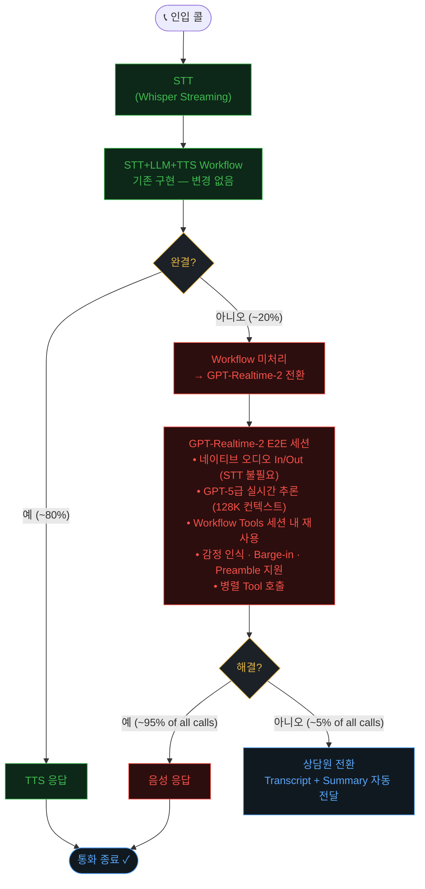

# GPT-Realtime-2 Live Demo — E-commerce Voice CS

하이브리드 고객서비스 아키텍처 라이브데모:  
**STT+LLM+TTS Workflow (Primary ~80%) + GPT-Realtime-2 E2E Fallback (~20%)**

> "Workflow가 처리하지 못한 복합/감정/모호 요청을 GPT-Realtime-2가 처리한다"

---

## 모델 사양

| 항목 | 값 |
|------|---|
| 모델명 | `gpt-realtime-2` |
| 버전 | `2026-05-06` |
| 상태 | Preview |
| 컨텍스트 | Input 32K / Output 4K tokens |
| 오디오 | PCM16 24kHz 스트리밍 |
| WebSocket 엔드포인트 | `/openai/v1/realtime?model={deployment}` |
| 주요 신기능 | 추론(Reasoning) 지원, 응답 단계(preamble + final), 향상된 instruction 준수 |
| 지원 리전 | GlobalStandard — AI Services 리소스는 `eastus2` 권장 (`swedencentral`, `southindia` 가능) |

---

## 데모 시나리오

| 프리셋 | 시나리오 | 포인트 |
|--------|---------|-------|
| S1 단순 FAQ | "배송 얼마나 걸려요?" | Primary Path 빠른 처리 (Workflow 완결) |
| S2 복합 의도 | 주문변경 + 배송지 + 쿠폰 동시 요청 | RT-2 Multi-tool, 복합 의도 처리 |
| S3 불만 고객 | "왜 이렇게 배송이 늦어요!" | RT-2 감정 인식 + 공감 응대 |
| S4 모호 요청 | "아 잠깐… 저 사실 환불을…" | RT-2 발화 수정/맥락 추론 |

---

## Option A: `azd up` (권장 — 자동화)

### 사전 요구사항

| 항목 | Windows | Linux | macOS |
|------|---------|-------|-------|
| [Azure CLI](https://docs.microsoft.com/cli/azure/install-azure-cli) | ✓ | ✓ | ✓ |
| [Azure Developer CLI (azd)](https://learn.microsoft.com/azure/developer/azure-developer-cli/install-azd) | ✓ | ✓ | ✓ |
| Python 3.11+ | ✓ | ✓ | ✓ |
| PowerShell (pwsh) | 기본 내장 | — | — |
| bash | — | 기본 내장 | 기본 내장 |

> **Windows**: PowerShell hook(`scripts/load_python_env.ps1`)이 자동 실행됩니다.  
> **Linux/macOS**: bash hook(`scripts/load_python_env.sh`)이 자동 실행됩니다.  
> 두 hook 모두 등록되어 있으며 해당 OS에서 동작하는 쪽만 실행됩니다.

> [!NOTE]
> **Windows에서 아래 경고가 출력되는 것은 정상입니다. 무시하세요.**
> ```
> WARNING: 'preprovision' hook failed ...: 'bash' is not recognized as an internal or external command
> ```
> Windows/Linux/macOS 동시 지원을 위해 sh(bash)와 pwsh(PowerShell) hook을 함께 등록했습니다.  
> Windows에서는 bash hook이 실패하고 PowerShell hook이 성공하며, Linux/macOS에서는 반대로 동작합니다.

### 실행

> [!IMPORTANT]
> `gpt-realtime-2`는 Preview 모델이며 기본 할당량이 **10 RPM**입니다.
> 할당량 증설 폼에는 아직 해당 모델이 등록되어 있지 않으므로, 기본 할당량 내에서 사용하세요.
> 배포 시 `Insufficient quota` 오류가 발생하면 기존 `gpt-realtime-2` 배포를 삭제하여 할당량을 회수한 뒤 다시 시도하세요.

#### Windows (PowerShell)

```powershell
azd auth login
azd env new rt2demo
azd env set AZURE_LOCATION eastus2
azd up
```

#### Linux / macOS

```bash
azd auth login
azd env new rt2demo
azd env set AZURE_LOCATION eastus2
azd up
```

`azd up` 수행 내용:
1. **preprovision hook** — Python venv 생성 + `pip install -r backend/requirements.txt`
2. **Bicep 배포** — 리소스 그룹, Azure AI Services (`@2026-03-01`), Foundry Project, `gpt-realtime-2` 모델 배포 (GlobalStandard, capacity 10)
3. **postprovision hook** — `backend/.env` 자동 생성 (endpoint / deployment)

> [!NOTE]
> `azd up` 시 모델 카탈로그 경고가 표시될 수 있지만, 계속 진행하면 정상 배포됩니다.
> `Insufficient quota` 오류 발생 시 기존 `gpt-realtime-2` 배포를 삭제하여 할당량을 회수한 뒤 다시 시도하세요.

### 로컬 실행

#### Windows

```powershell
cd backend
.venv\Scripts\activate
uvicorn main:app --reload --port 8000
```

#### Linux / macOS

```bash
cd backend
source .venv/bin/activate
uvicorn main:app --reload --port 8000
```

브라우저: `http://localhost:8000`

---

## Option B: 수동 설정

### 1. Azure 리소스 준비

Azure Portal 또는 AI Foundry 포털에서 아래 리소스를 생성하세요:

- **Azure AI Services** (kind: AIServices, `eastus2` 권장 — Realtime 모델 GlobalStandard 지원 리전)
- **모델 배포**: `gpt-realtime-2` (version: `2026-05-06`, SKU: GlobalStandard)

### 2. 환경 변수 설정

#### Windows

```powershell
copy .env.example backend\.env
```

#### Linux / macOS

```bash
cp .env.example backend/.env
```

`backend/.env`를 편집하여 값을 채우세요:

```
AZURE_OPENAI_ENDPOINT=https://<your-resource>.openai.azure.com/
AZURE_OPENAI_DEPLOYMENT=gpt-realtime-2
```

> 인증은 `DefaultAzureCredential` (`az login` / Managed Identity)을 사용합니다.  
> API Key 인증은 보안 정책에 의해 비활성화되어 있습니다 (`disableLocalAuth: true`).

### 3. Python 환경

#### Windows

```powershell
cd backend
python -m venv .venv
.venv\Scripts\activate
pip install -r requirements.txt
```

#### Linux / macOS

```bash
cd backend
python -m venv .venv
source .venv/bin/activate
pip install -r requirements.txt
```

### 4. 실행

```bash
uvicorn main:app --reload --port 8000
```

브라우저: `http://localhost:8000`

---

## 하이브리드 아키텍처 — 호출 흐름

> "STT+LLM+TTS Workflow를 대체하지 않고, Workflow가 처리하지 못한 ~20%를 GPT-Realtime-2가 담당한다"

### 전체 호출 흐름



### 접근 방식별 비교

| 항목 | Approach A (현재) | Approach C (RT-2 Full E2E) | **Hybrid (권장)** |
|------|--------------|---------------------|------------|
| 아키텍처 | STT → Workflow → TTS | RT-2 E2E (전체 콜) | A Primary + C Fallback ~20% |
| 비용/콜 | ~$0.11 | ~$0.18 (+64%) | **~$0.13 (+18%)** |
| 상담원 개입률 | ~20% | ~5% | **~5%** |
| 음성 자연스러움 | 낮음 (TTS 합성) | 높음 (네이티브) | **높음 (fallback 구간)** |
| 기존 구현 보전 | ✓ | ✗ 전면 교체 | **✓ 변경 없음** |
| RT-2 활용도 | 없음 | 100% | **100% (fallback 구간)** |

> **비용:** Primary 80% × $0.11 + Fallback 20% × $0.18 ≈ **$0.13/콜**  
> **효과:** 상담원 개입률 ~20% → ~5% (−75%), 전체 CS 비용 약 30–40% 절감 예상

---

## 아키텍처

```
Browser
├── WebSocket /ws  ←→  FastAPI Backend
│     ├── PCM16 24kHz 오디오 스트림
│     ├── transcript / agent_switch / tool_call 이벤트
│     └── demo_inject (시나리오 제어)
└── Web Audio API (마이크 캡처 + PCM16 재생)

FastAPI Backend
├── RealtimeClient  →  Azure AI Services (gpt-realtime-2)
│     └── wss://{endpoint}/openai/v1/realtime?model=gpt-realtime-2
├── AssistantService (Root → Order / Delivery / Refund)
└── DemoState  →  Tool 목업 응답 주입

gpt-realtime-2 세션 설정 (신규 스키마):
  session.type = "realtime"
  session.audio.input.turn_detection = server_vad
  session.audio.output.voice = "alloy"
  session.output_modalities = ["audio"]

에이전트 구조:
  Root (라우터)
    ├── OrderAssistant      — lookup_order, cancel_order
    ├── DeliveryAssistant   — lookup_delivery, update_address
    ├── RefundAssistant     — process_refund, apply_coupon
    ├── ProductAssistant    — lookup_product, check_stock
    ├── MembershipAssistant — check_points, register_membership
    └── AfterServiceAssistant — report_defect, check_warranty

Azure 인프라 (Bicep):
  Microsoft.CognitiveServices/accounts@2026-03-01 (AIServices, disableLocalAuth=true)
    ├── deployments/gpt-realtime-2 (GlobalStandard, 2026-05-06, eastus2)
    └── projects/proj-* (CognitiveServices/accounts/projects — 신규 Foundry 구조)
```

---

## 프로젝트 구조

```
gpt-realtime-2-livedemo/
├── backend/
│   ├── main.py                  # FastAPI + WebSocket 엔드포인트
│   ├── realtime_client.py       # gpt-realtime-2 클라이언트 (GA endpoint)
│   ├── assistant_service.py     # 멀티에이전트 오케스트레이터
│   ├── demo_state.py            # 데모 상태 주입 (이커머스)
│   ├── agents/
│   │   ├── root.py
│   │   ├── order.py
│   │   ├── delivery.py
│   │   ├── refund.py
│   │   ├── sales.py         # 상품 문의
│   │   ├── activation.py    # 회원/포인트
│   │   └── technical.py     # A/S 불량
│   └── requirements.txt
├── frontend/
│   ├── index.html
│   ├── app.js
│   └── style.css
├── infra/
│   ├── main.bicep
│   ├── main.parameters.json
│   └── modules/
│       ├── dependent_resources.bicep  # AI Services + gpt-realtime-2 배포
│       └── foundry_project.bicep     # Foundry Project (CognitiveServices/accounts/projects)
├── scripts/
│   ├── load_python_env.sh / .ps1
│   └── write_env.sh / .ps1
├── azure.yaml
└── .env.example
```
